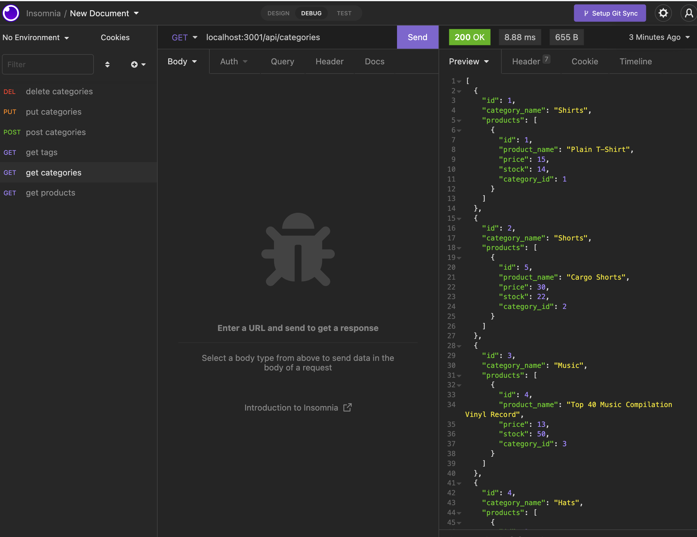

# ORM E-Commerce Backend API

- [Description](#description)
- [Installation](#installation)
- [Questions](#questions)
- [License?](#license)

## Description

This is a restful back end api for an e-commerce site. It allows user to view, update, and delete the products through api.

## Installation

Clone the project and start with running the code `npm run seed` followed by `node server.js`

## Questions

Send me an email [here](mailto:james91055@gmail.com) to contact me directly.

## License

This project is licensed under the [MIT License](https://choosealicense.com/licenses/mit/) - click the link to read the license.

## Demo

[Video Demo](https://www.loom.com/share/ebf61a9c0c5e4a1aa12380ff01557b43)

